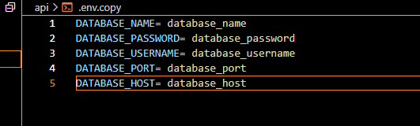

## WHAT IS ORGANIZE-360 ?

Organize-360 is a basic task management application that can be used as your todo list application with extra capabilities of allowing users to register eventgs which in turn can be registered into their calendar (beta feature. Not yet added..)

The usee is required to create an account with the application to ensure that they have access to its features.

## HOW TO START UP THE APPLICATION ON LOCAL MACHINE.

With the current changes added to the project, follow the following steps to start up the project on your own local machine:

1. Clone this repository on your own local machine using the command:

```terminal
git clone https://github.com/IsaacHarrison28/Organize-360.git
```

2. open the cloned github repository in your IDE of choice (VS code recommended.)

3. In your terminal, navigate into the Organize-360 folder and open the api/ folder to start the backend api using the command:

```
npm install
```

At this point, connect a postgresql database to the api by creating a .env file in the root of the api/ directory. Use the blueprint defined in the .env.copy file as shown in the image below:


After you have added the credentials needed, run the following command in your terminal to start the api:

```
npm run start
```

4. Without closing the terminal running the api/, open a new terminal window and start the front end by navigating into frontend/ directory and running this command in your terminal:

```
npm install
```

then followed by:

```
npm start
```
